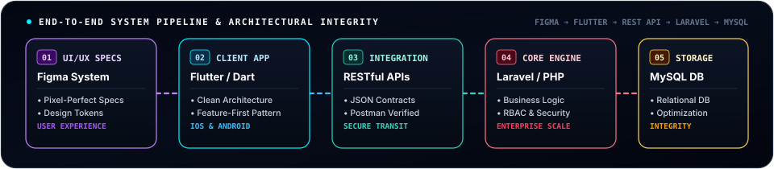
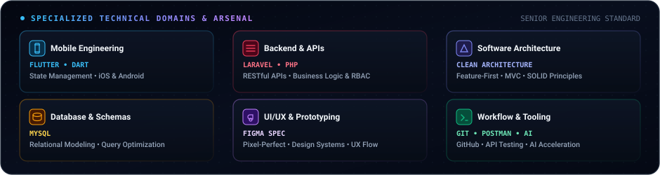

<div align="center">

  <!-- ================= TOP LANGUAGE SWITCHER BAR ================= -->
  <a href="README.md">
    
  </a>
  &nbsp;&nbsp;
  <a href="README.ar.md">
    
  </a>

  <br/><br/>

  <!-- ================= COURSERA-INSPIRED MASTER HERO ================= -->
  <a href="https://github.com/Alomary-Ali">
    
  </a>

  <br/><br/>

  <!-- Coursera Royal Blue Quick Links Bar -->
  <a href="mailto:ali.q.alomary@gmail.com">
    
  </a>
  <a href="https://linkedin.com/in/ali-al-omary" target="_blank">
    
  </a>
  <a href="https://alomary-ali.site.je" target="_blank">
    
  </a>
  <a href="https://github.com/Alomary-Ali">
    
  </a>

</div>

<br/>

---

### ✦ Architectural Philosophy & Engineering Standards

> *"Bridging resilient enterprise architectures with fluid, pixel-perfect user experiences."*

Operating at the intersection of **Mobile Engineering (Flutter)** and **Backend Architecture (Laravel)**, I engineer systems with an emphasis on structural longevity, security, and human-centered design:

* **Clean Architecture & Feature-First**: Decoupling the domain, data, and presentation layers to ensure codebases are modular, testable, and maintainable over years of iteration.
* **Enterprise Backend & RESTful APIs**: Developing robust, secured RESTful APIs with **Laravel**, backed by granular Role-Based Access Control (RBAC) and normalized **MySQL** database schemas.
* **Fluid Mobile Experiences**: Delivering reactive, 60fps cross-platform mobile apps (**iOS & Android**) using **Flutter**, executing Figma design systems with strict pixel-perfect precision.

---

### ✦ System Pipeline & Architectural Flow

The interactive blueprint below illustrates the full-lifecycle data and interface pipeline implemented across client platforms:

<div align="center">
  
</div>

<br/>

---

### ✦ Specialized Technical Domains & Arsenal

<div align="center">
  
</div>

<br/>

---

### ✦ Featured Production & Engineering Projects

<table>
  <tr>
    <td width="50%" valign="top">
      <h3>01. SOUQAK Platform &amp; Uni-Cart</h3>
      <p>
        
        
      </p>
      <p>Full-scale commercial platform connecting a responsive Flutter mobile client with a Laravel Uni-Cart administration engine.</p>
      <ul>
        <li><b>Architecture:</b> Feature-First Flutter mobile architecture integrated via secured RESTful APIs with a multi-tenant Laravel backend.</li>
        <li><b>Execution:</b> Cart lifecycle state management, real-time checkout syncing, and optimized product queries.</li>
        <li><b>Fidelity:</b> Pixel-perfect execution directly aligned with custom Figma design tokens.</li>
      </ul>
      <p>
        <code>Flutter</code> • <code>Laravel</code> • <code>Uni-Cart</code> • <code>RESTful APIs</code> • <code>MySQL</code>
      </p>
      <p>
        <a href="https://isnadcompany.alwaysdata.net/" target="_blank">
          
        </a>
      </p>
    </td>
    <td width="50%" valign="top">
      <h3>02. Bnaytic Platform (Benaytark)</h3>
      <p>
        
        
      </p>
      <p>Enterprise administrative backend built to manage operational data, security authorization, and automated reporting templates.</p>
      <ul>
        <li><b>Architecture:</b> Domain-driven service layers in Laravel enforcing strict authorization and workflow tracking.</li>
        <li><b>Security:</b> Fine-grained Role-Based Access Control (RBAC) protecting sensitive company modules.</li>
        <li><b>Dynamic Templating:</b> Automated engine for rendering and printing official technical reports.</li>
      </ul>
      <p>
        <code>Laravel</code> • <code>PHP</code> • <code>MySQL</code> • <code>Dynamic Reports</code> • <code>RBAC</code>
      </p>
      <p>
        <a href="https://alomary.alwaysdata.net/" target="_blank">
          
        </a>
      </p>
    </td>
  </tr>
  <tr>
    <td width="50%" valign="top">
      <h3>03. Rafiq Al-Talib (رفيق الطالب)</h3>
      <p>
        
        
      </p>
      <p>High-velocity technical MVP engineered under intensive competitive time constraints during the Qabilah Hackathon.</p>
      <ul>
        <li><b>Rapid Delivery:</b> Formulated core architectural scope and implemented foundational user journeys under tight deadlines.</li>
        <li><b>Agile Architecture:</b> Full-stack implementation focused on core usability, speed, and clean code principles.</li>
      </ul>
      <p>
        <code>Rapid MVP</code> • <code>Full-Stack</code> • <code>Hackathon Sprint</code>
      </p>
      <p>
        <a href="https://qabilah.com/hackathon/255665101472799432/projects/259708267620470784" target="_blank">
          
        </a>
      </p>
    </td>
    <td width="50%" valign="top">
      <h3>04. Smart Farm System (المزارع الذكي)</h3>
      <p>
        
        
      </p>
      <p>Integrated agricultural management platform combining relational data tracking, backend services, and a mobile client.</p>
      <ul>
        <li><b>Full-Stack Scope:</b> Built backend services and relational MySQL schemas managing farm records and metrics.</li>
        <li><b>Mobile Client:</b> Flutter mobile app engineered directly from pre-designed Figma UI/UX prototypes.</li>
      </ul>
      <p>
        <code>Laravel</code> • <code>MySQL</code> • <code>Flutter</code> • <code>Figma Spec</code> • <code>REST APIs</code>
      </p>
      <p>
        <a href="https://github.com/Alomary-Ali" target="_blank">
          
        </a>
      </p>
    </td>
  </tr>
</table>

---

### ✦ Professional Leadership & Track Record

#### **Freelance Full-Stack Developer &amp; Core Team Member**  
**Isnad Software (إسناد للبرمجيات)** • *2023 – 2026*

* **Team Coordination**: Co-founded and collaborated in a 4-engineer freelance unit, coordinating agile sprints, architecture reviews, and client deliverables.
* **Requirements Analysis**: Spearheaded system architecture, translating complex business needs into clean relational schemas (MySQL) and technical specifications.
* **RESTful API Engineering**: Built secure, authenticated RESTful APIs in Laravel supporting multi-platform clients.
* **Cross-Platform Mobile**: Delivered responsive Android and iOS apps using Flutter with strict state management and zero layout drift against Figma.
* **Standardization**: Championed Clean Architecture and Feature-First methodologies across projects, ensuring codebase maintainability and long-term health.

---

### ✦ Academic Foundations & Coursera Certifications

* **Bachelor of Information Technology**  
  *Al-Rasheed University (جامعة الرشيد)* • *2021 – 2026*
* **AI Application Development (Summer Bootcamp)**  
  *EMC Foundation (مؤسسة EMC)*

#### **Verified Coursera Certifications**:
<p>
  
  
  
  
</p>

---

### ✦ Real-Time Analytics & Contribution Trajectory

<div align="center">
  <table border="0">
    <tr>
      <td align="center" width="50%">
        
      </td>
      <td align="center" width="50%">
        
      </td>
    </tr>
  </table>

  <br/>

  <!-- Verified GitHub Contribution Streak -->
  

  <br/><br/>

  <!-- Automated Contribution Snake in Luxury Coursera Blue Palette -->
  <picture>
    <source media="(prefers-color-scheme: dark)" srcset="https://raw.githubusercontent.com/Alomary-Ali/Alomary-Ali/output/github-contribution-grid-snake-dark.svg" />
    <source media="(prefers-color-scheme: light)" srcset="https://raw.githubusercontent.com/Alomary-Ali/Alomary-Ali/output/github-contribution-grid-snake.svg" />
    
  </picture>

</div>

---

### ✦ Direct Channel & Engagement Matrix

<div align="center">

| Channel | Identifier | Direct Action |
| :--- | :--- | :--- |
| **Direct Inquiries** | `ali.q.alomary@gmail.com` | [✉️ Initiate Correspondence](mailto:ali.q.alomary@gmail.com) |
| **Professional Network** | `in/ali-al-omary` | [💼 Connect on LinkedIn](https://linkedin.com/in/ali-al-omary) |
| **Engineering Portfolio** | `alomary-ali.site.je` | [🌐 Launch Live Portfolio](https://alomary-ali.site.je) |
| **Source Repositories** | `@Alomary-Ali` | [🐙 Browse Repositories](https://github.com/Alomary-Ali) |
| **Base Location** | Sana'a, Yemen (UTC+3) | [📍 Remote &amp; Global Availability](mailto:ali.q.alomary@gmail.com) |

</div>

<br/>

<div align="center">

```
"Architecting resilient backends and fluid mobile experiences with uncompromising design precision."
```

<sub>Crafted with architectural precision for <b>Ali Qaid Saeed Alomary</b> • © 2026</sub>

</div>
